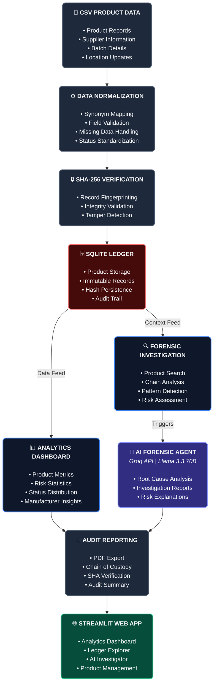

I see the exact issue! There were hidden spaces (or indentation) right before the closing ``` tag of your Mermaid block, which breaks GitHub's markdown renderer.

Here is the fully corrected, ready-to-paste `README.md`. I fixed the indentation on the closing backticks and cleaned up the hidden spaces inside the block so it will render perfectly.

```markdown
# 🔗 Supply Chain Verification Agent

> An AI-powered, terminal-to-web agent designed to simulate immutable ledger tracking, validate product provenance, and autonomously detect supply chain anomalies.


---

## 📌 Overview

Modern supply chains suffer from fragmented data pipelines, opaque transit logs, and an ever-growing risk of counterfeit product injection. Traditional auditing systems are reactive — they catch problems after the damage is done.

The **Supply Chain Verification Agent** is a proactive, AI-driven auditor. It cross-references manufacturing records, transit checkpoints, and batch metadata to guarantee product authenticity — mirroring the validation protocols used in decentralized enterprise networks like Hyperledger Fabric.

Built as a full-stack AI agent, it combines a reasoning LLM, a structured ledger, semantic data ingestion, and a real-time analytics dashboard into a single deployable web application.

---

## 🏗️ System Architecture



### How It Works

1. **Data Ingestion** — Raw supply chain data (CSV or manual entry) is ingested through a semantic mapper that normalizes any column schema into the core ledger fields. Unmapped columns are preserved in a JSON blob for AI context.
2. **Reasoning Engine** — Each product verification triggers a forensic prompt to LLaMA 3.3 70B via Groq API. The model identifies *why* something is flagged, assigns a risk level (LOW / MEDIUM / HIGH), and gives an actionable recommendation.
3. **Anomaly Detection** — The agent evaluates unverified transit stages, suspicious location hops, and cross-manufacturer flag patterns to surface systemic risks — not just individual product issues.
4. **State Management** — Every record is logged with a timestamp in SQLite, simulating a tamper-proof audit history with indexed queries for fast retrieval at scale.

---

## 🛠️ Tech Stack

| Layer | Technology |
| --- | --- |
| Backend & Logic | Python 3.10+ |
| Database | SQLite + Pandas |
| AI / LLM | Groq API — LLaMA 3.3 70B |
| Semantic Mapping | thefuzz (fuzzy string matching) |
| Frontend UI | Streamlit |
| PDF Export | ReportLab |
| Data Visualization | Plotly Express |
| Deployment | Streamlit Cloud |

---

## ⚡ Quickstart

### 1. Clone the Repository

```bash
git clone https://github.com/Donaldo-Crish/supply-chain-verification-agent.git
cd supply-chain-verification-agent

```

### 2. Create & Activate Virtual Environment

```bash
python -m venv venv

# Windows
venv\Scripts\activate

# Mac/Linux
source venv/bin/activate

```

### 3. Install Dependencies

```bash
pip install -r requirements.txt

```

### 4. Set Up Environment Variables

Create a `.env` file in the root directory:

```
GROQ_API_KEY=your_groq_api_key_here

```

Get your free API key at [console.groq.com](https://console.groq.com)

### 5. Run the Agent

```bash
# Test the backend reasoning engine directly
python agent.py

# Launch the full web application
streamlit run app.py

```

---

## 🔑 Key Features

* **🧠 Forensic AI Reasoning** — Explains *why* a product is flagged with specific risk levels and recommendations
* **🏭 Manufacturer Pattern Detection** — Identifies systemic risks across multiple flagged products from the same source
* **💬 Contextual Chat Interface** — Ask follow-up questions about any verified product in natural language
* **📄 PDF Audit Export** — Professional audit reports downloadable for compliance and record-keeping
* **📊 Analytics Dashboard** — Real-time charts: status distribution, flagged by location, manufacturer risk, manufacturing timeline, and risk heatmap
* **🔄 Semantic Bulk Ingestion** — Upload any CSV schema — the mapper intelligently normalizes column names using fuzzy matching and synonym detection
* **➕ Live Ledger Management** — Add, update, and reset product records directly from the UI

---

## 📁 Project Structure

```
supply-chain-verification-agent/
├── agent.py           # Groq API reasoning engine, chat, pattern detection
├── app.py             # Streamlit frontend — all tabs and UI logic
├── database.py        # SQLite ledger, semantic mapper, cached queries
├── pdf_export.py      # ReportLab PDF generation
├── migrate_data.py    # CSV to SQLite migration utility
├── products.csv       # Sample product ledger data
├── .gitignore         # Excludes .env, venv, __pycache__, *.db
└── README.md          # You are here

```

---

## 🗺️ Roadmap

* [ ] **Blockchain Integration** — Migrate from SQLite to a live decentralized node (Ethereum / Hyperledger Fabric / Corda Enterprise) for cryptographic, tamper-proof validation
* [ ] **Multi-Agent Reasoning** — Parallel AI agents handling different supply chain segments simultaneously for complex logistical bottleneck detection
* [ ] **RFID / IoT Integration** — Real-time checkpoint scanning feeding directly into the verification pipeline
* [ ] **Email / Webhook Alerts** — Automated notifications when high-risk products are detected
* [ ] **Role-Based Access Control** — Separate views for auditors, suppliers, and administrators

---

## 👤 Author

**Pravin S** (Donaldo-Crish)
Pravin S | Mechatronics engineering & Automation | AI Agent Architect

---

*Built with LLaMA 3.3 70B via Groq API — one of the fastest open-source inference engines available.*

```


```