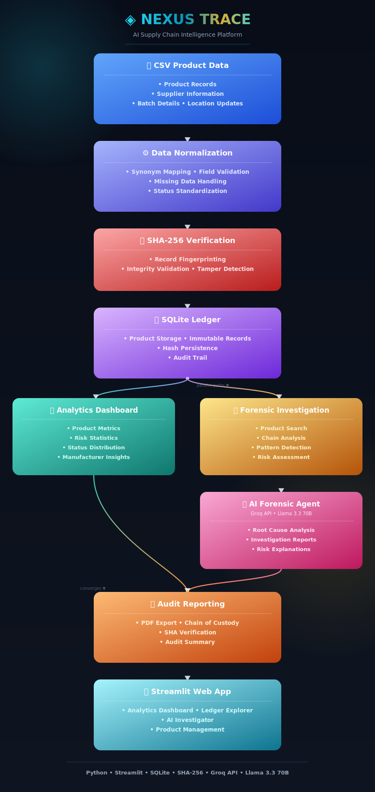

# [NEXUS TRACE](https://your-streamlit-app-url.streamlit.app) | Supply Chain Forensics Platform
[](https://your-streamlit-app-url.streamlit.app)

> ***An AI-powered supply chain auditing and verification platform that cryptographically fingerprints supply-chain records, analyzes historical ledger data, and generates forensic audit reports.***


---

# 📌 **Overview**

Modern supply chains suffer from fragmented data pipelines, opaque transit logs, and an ever-growing risk of counterfeit product injection. Traditional auditing systems are reactive — they catch problems after the damage is done.

The **NEXUS TRACE** is an AI-driven auditing and forensic analysis platform for supply-chain records. Every record entering the ledger is cryptographically fingerprinted with SHA-256, normalized through a fuzzy-matching semantic mapper, and made available to a reasoning LLM that reconstructs a simulated chain of custody, identifies anomalies, and explains why a record may require further investigation.

This project uses a SQLite-backed ledger with SHA-256 integrity verification. While it is not a blockchain implementation, it demonstrates how cryptographic fingerprints, audit trails, and verification workflows can be applied to supply-chain records.

The architecture is intentionally modular so the storage layer could later be replaced with a distributed ledger such as Hyperledger Fabric without redesigning the reasoning layer.

---

## 🎯 Project Scope

This project focuses on auditing and verification of historical supply-chain records rather than real-time shipment tracking.

Product records are ingested into a SQLite-backed ledger, normalized through fuzzy semantic mapping, cryptographically fingerprinted using SHA-256, and analyzed using an AI forensic investigator.

The current implementation demonstrates supply-chain auditing, anomaly investigation, manufacturer risk analysis, conversational product analysis, and compliance-style reporting.

Future versions could integrate RFID systems, IoT sensors, ERP platforms, blockchain networks, or logistics APIs for real-time event tracking.

## 🏗️ System Architecture



### How It Works

1. **Data Ingestion** — Products are added one at a time via a form, or in bulk via CSV upload. The semantic mapper (`thefuzz`) scores each incoming column against a synonym table and suggests a target field with a confidence percentage; any column you don't map is preserved as a JSON blob (`extra_data`) instead of being discarded.
2. **Status Normalization** — Arbitrary status strings (`pass`, `cleared`, `fail`, `hold`, etc.) are normalized into one of three ledger states: `VERIFIED`, `FLAGGED`, or `PENDING`.
3. **Cryptographic Fingerprinting** — Each record is hashed with SHA-256 over its product ID, manufacturer, batch ID, location, and status, producing a unique fingerprint stored alongside the row.
4. **Ledger Storage** — Records land in an indexed SQLite table (`product_id`, `status`, `manufacturer`) for fast filtering at scale.
5. **Forensic Reasoning** — Verifying a product triggers a prompt to Llama 3.3 70B via Groq. The model is handed the record, a simulated chain-of-custody (Manufacturer → Quality Control → Transit → Distribution), and a historical event count cross-referenced against the original `products.csv` import — then returns a status, a specific reason, a risk level, and one recommendation.
6. **Manufacturer Pattern Detection** — A SQL aggregation surfaces the manufacturers with the highest flagged-product counts; the same reasoning engine writes a short executive summary of the systemic risk.
7. **Conversational Follow-up** — A chat interface answers free-form questions about a specific product, grounded in its ledger record, simulated journey, and historical count.
8. **Audit Export** — A ReportLab-generated PDF captures the product details, SHA-256 fingerprint, chain-of-custody table, and the AI's findings for compliance record-keeping.

---

## 🛠️ Tech Stack

| Layer | Technology |
|---|---|
| Backend & Logic | Python 3.10+ |
| Frontend UI | Streamlit ≥ 1.58 |
| Database | SQLite + Pandas ≥ 3.0.3 |
| AI / LLM | Groq API — `llama-3.3-70b-versatile` |
| Integrity | SHA-256 (`hashlib`) |
| Semantic Mapping | thefuzz ≥ 0.22.1 (fuzzy synonym matching) |
| Data Visualization | Plotly Express ≥ 6.8.0 |
| PDF Export | ReportLab ≥ 4.5.1 |
| Config | python-dotenv ≥ 1.2.2 |

---

## ⚡ Quickstart

### 1. Clone the Repository
```bash
git clone https://github.com/Donaldo-Crish/supply-chain-verification-agent.git
cd supply-chain-verification-agent
```

### 2. Create & Activate a Virtual Environment
```bash
python -m venv venv

# Windows
venv\Scripts\activate

# Mac/Linux
source venv/bin/activate
```

### 3. Install Dependencies
```bash
pip install -r requirements.txt
```

### 4. Set Up Environment Variables
Create a `.env` file in the root directory:
```
GROQ_API_KEY=your_groq_api_key_here
```
Get a free API key at [console.groq.com](https://console.groq.com). Without it, the app still runs and the ledger still works — AI analysis simply returns a "not configured" notice instead of a forensic report.

### 5. Make Sure `products.csv` Is Present
The historical event lookup (used in both the AI Forensic Investigator and the agent's reasoning prompts) reads directly from `products.csv` in the project root, separately from the live SQLite ledger. Keep a copy of your product manifest there even after you've ingested it into the database.

### 6. Run the App
```bash
streamlit run app.py
```

---

## 🔑 Key Features

- **🔒 SHA-256 Record Fingerprinting** — every ledger entry is hashed (product ID + manufacturer + batch + location + status) and the fingerprint is surfaced in both the UI and the PDF export.
- **🧠 Forensic AI Reasoning** — explains *why* a product is flagged, pending, or verified, assigns a LOW / MEDIUM / HIGH risk level, and gives one actionable recommendation.
- **🏭 Manufacturer Risk Pattern Detection** — a one-click scan aggregates flag rates per manufacturer and has the AI write an executive summary of the riskiest sources.
- **🔍 Multi-Product Forensic Search** — punctuation-insensitive, comma-separated search (`PRD-9272`, `9272`, `Component-9272` all match) returns matching product cards with live status and SHA-256 verification badges.
- **💬 Contextual Chat per Product** — ask follow-up questions grounded in the product's ledger record, simulated chain of custody, and historical event count.
- **📄 PDF Audit Export** — a ReportLab report with a color-coded status badge, cryptographic fingerprint box, chain-of-custody table, and the AI's findings.
- **📊 Analytics Dashboard** — live metrics, anomaly visualizations, manufacturer risk analysis, location-based anomaly tracking, manufacturing timelines, and risk heatmaps.
- **🔄 Semantic Bulk Ingestion** — upload any CSV schema; fuzzy matching suggests a column mapping with a confidence score, with manual override per column before you commit.
- **📇 Ledger Browser & Record Explorer** — filter by status, manufacturer, or location with color-coded rows.
- **➕ Live Ledger Management** — add records via form, bulk-ingest via CSV, or wipe the ledger from a confirmation-gated "Danger Zone" (must type `DELETE`).
---

## 📁 Project Structure

```
supply-chain-verification-agent/
├── app.py                   # Streamlit frontend — all 4 views, sidebar, styling
├── agent.py                 # Groq reasoning engine, chat, journey simulation, risk patterns
├── database.py              # SQLite ledger, SHA-256 hashing, semantic mapper
├── pdf_export.py            # ReportLab audit PDF generation
├── architecture-diagram.svg # System architecture diagram (this README)
├── products.csv             # Source manifest — also used for historical lookups
├── requirements.txt
├── .env                     # GROQ_API_KEY (gitignored)
├── .gitignore               # Excludes .env, venv, __pycache__, *.db
└── README.md                # You are here
```

> Screenshots will be added once the UI is fully polished.

---

## 🗺️ Roadmap

- [ ] **Blockchain Integration** — migrate from SQLite to a live decentralized node (Ethereum / Hyperledger Fabric / Corda Enterprise) for cryptographically enforced immutability
- [ ] **Multi-Agent Reasoning** — parallel AI agents handling different supply chain segments simultaneously
- [ ] **RFID / IoT Integration** — real-time checkpoint scanning feeding directly into the verification pipeline
- [ ] **Email / Webhook Alerts** — automated notifications when high-risk products are detected
- [ ] **Role-Based Access Control** — separate views for auditors, suppliers, and administrators

---

## 👤 Author

**Pravin S** 
Mechatronics Engineering & Automation | AI Agent Architect

---

*Built with Llama 3.3 70B via Groq API.*

## 🤝 Acknowledgements

Development of this project was accelerated through the use of AI-assisted tools including ChatGPT, Claude, Gemini, and Perplexity for brainstorming, debugging, documentation, and design iteration.
